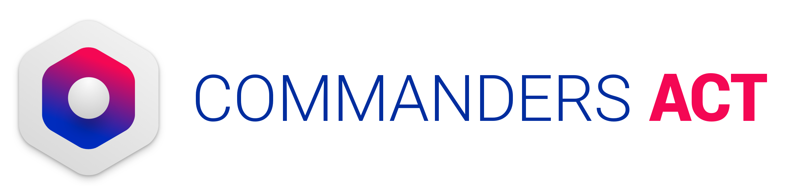

# Read me :

This is a demo app for implementing commandersAct's flutter bridges

* [TCCore](https://github.com/CommandersAct/tccore_plugin)
* [TCServerSide](https://github.com/CommandersAct/tcserverside-flutter-plugin)
* [TCConsent](https://github.com/CommandersAct/tcconsent-flutter-plugin)

Main code will be inside : lib/Main.dart file

More importantly, you'll need to read the native documentation for full details.
 * [Android](https://github.com/CommandersAct/Androidv5)
 * [iOS](https://github.com/commandersact/iosv5)

This app displays buttons to interact with the SDK. You can check the Xcode console or Android Logcat for SDK logging.

# Support & Contact : 

Support : support@commandersact.com

http://www.commandersact.com

Commanders Act | 7b rue taylor - 75010 PARIS - France

